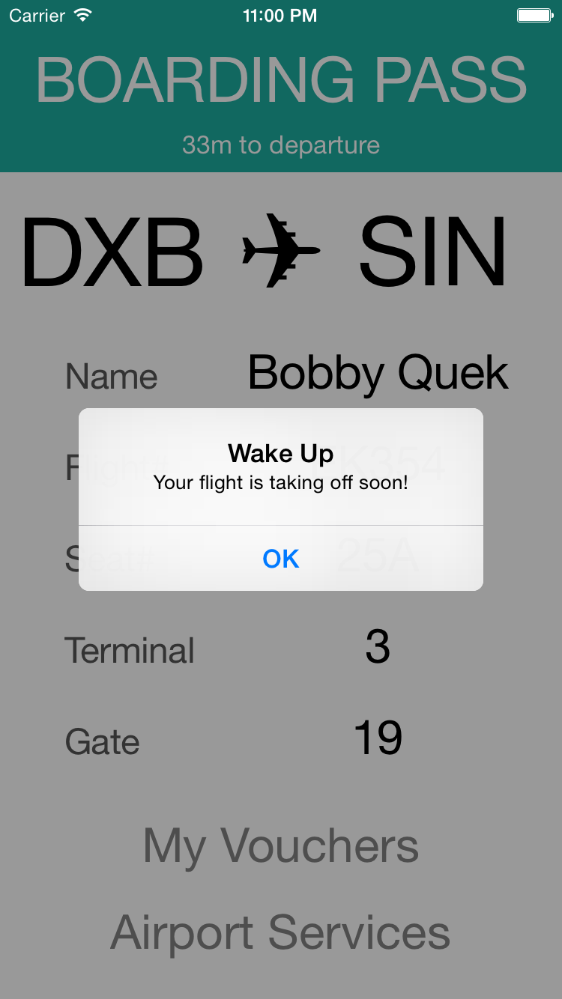
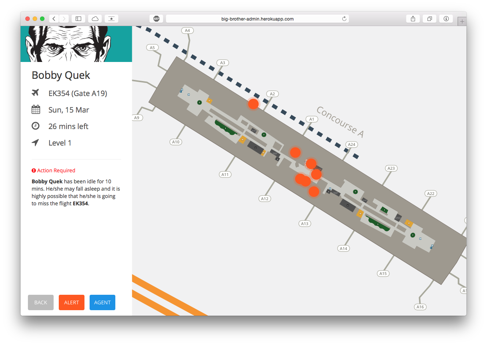

# BigBrother
Big Brother takes care of you in everything. 

This app contains three parts:
* Mobile Client
* Admin Website
* Backend Server

### What is BigBrother?
BigBrother is an an app that takes care of passengers while they are waiting for their transit in airports. 
It uses beacons for in-door location tracking, and based on the user preferences, pops up vouchers to lucky customers when they walk by a store. Offers are limited. Users don't know when they or where they will get one, but there will often be surprises. This encourages passengers to walk around and shopping when they are waiting for transit instead of sitting or sleeping. Hence it will keep the passengers awake, thus reduce the amount of late passengers and therefore the amount of time and economic lost due to flight delays. 

But you know what? Who is the Big Brother? In fact, our airport admins are the big brother. Our admin site provides shows a list of inactive users on a map. If a user has been inactive for more than a certain threshold amount of time, and his flight is taking off soon, we will sent him a notification to his phone telling him to get ready. But what if the user does not see our notification, probably because they are sleeping? Fret not! Since we are able to do indoor location tracking, we therefore are able to send an agent to the passenger to wake him up and help him get ready. In this way, the passengers never need to worry about being late for their flight if they want to take a sleep at the airport, and they might feel privileged being wake up friendly by an agent of the airport, telling them that their flight is taking off soon. 

### iPhone Client

### Admin Website

